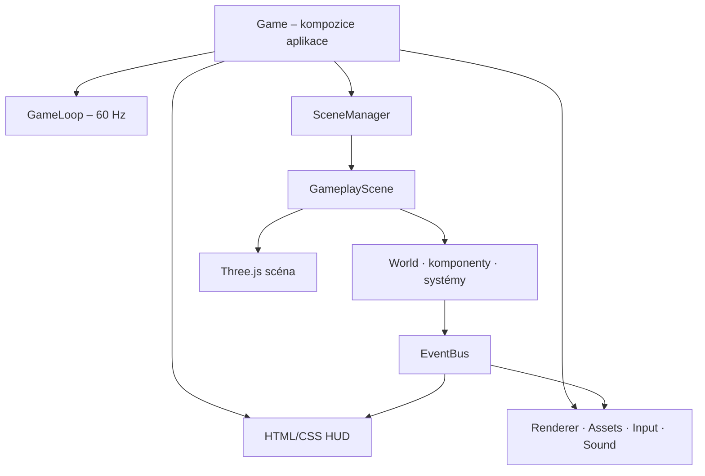
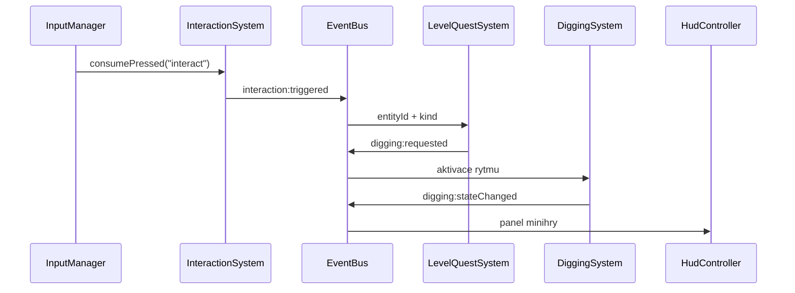

# Technická architektura hry Lovec vltavínů

Stav dokumentu: release 0.15.0  
Platforma: moderní browser, desktop i mobil  
Technologie: TypeScript, Three.js, Vite, HTML/CSS, Web Audio, PWA

Tento dokument je autoritativní popis implementované architektury. Popisuje
aktuální zdrojový kód, nikoli hypotetický návrh. Save systém není součástí
architektury; průběh výpravy existuje pouze v operační paměti stránky.

## 1. Architektonické cíle

- Jeden persistentní `THREE.WebGLRenderer` pro celou aplikaci.
- 2D postavy jako transparentní PNG sprite atlasy vložené do 3D scény přes
  `THREE.Sprite`.
- Významné objekty prostředí jako optimalizované low-poly GLB modely.
- HUD, dialogy, briefing, pauza a dotykové ovládání jako HTML/CSS overlay nad
  WebGL canvasem.
- Asynchronní a bezpečný lifecycle scén.
- Assety řízené manifestem a levelovými bundly.
- Sjednocený vstup z klávesnice a dotyku.
- Lehká komponentová architektura bez externí ECS knihovny.
- Deterministická simulace v pevném kroku 60 Hz a interpolovaný render.
- 2D kolize v rovině X/Z s prostorovým hashem a oboustrannými layer/mask filtry.
- Typovaný frontovaný event bus pro komunikaci mezi gameplayem, HUD a zvukem.
- Žádné ukládání postupu, inventář ani dialogový strom.

## 2. Přehled runtime



`Game` vlastní dlouho žijící služby. `GameplayScene` vlastní data a Three.js
objekty jednoho právě načteného levelu. Scéna se při přechodu zlikviduje a
nová se vytvoří z dat `LevelDefinition` a odpovídajícího asset bundlu.

## 3. Strom složek

```text
lovec-vltavinu/
├── index.html                         # canvas a kompletní HTML struktura HUD
├── package.json                       # příkazy, verze a závislosti
├── tsconfig.json                      # striktní TypeScript konfigurace
├── vite.config.ts                     # relativní GitHub Pages build
├── public/
│   ├── assets/
│   │   ├── manifest.json              # registr assetů a levelových bundlů
│   │   ├── atlases/                   # JSON definice 4×4 sprite atlasů
│   │   ├── sprites/                   # transparentní produkční PNG
│   │   └── models/                    # low-poly GLB modely
│   ├── icon.svg                       # ikona PWA
│   ├── site.webmanifest               # installable web app metadata
│   └── sw.js                          # offline app shell
├── src/
│   ├── main.ts                        # boot, PWA registrace, startup error UI
│   ├── styles.css                     # responzivní HUD a mobilní safe-area
│   ├── app/
│   │   ├── Game.ts                    # composition root a stav aplikace
│   │   ├── GameLoop.ts                # fixed-step loop + interpolace
│   │   └── SessionState.ts            # pouze paměťový postup výpravy
│   ├── core/
│   │   └── events/
│   │       ├── EventBus.ts             # typovaná FIFO fronta událostí
│   │       └── GameEvents.ts           # úplný kontrakt herních eventů
│   ├── engine/
│   │   ├── animation/
│   │   │   └── SpriteAnimator.ts       # klipy, směry a UV atlasu
│   │   ├── assets/
│   │   │   ├── AssetManager.ts         # manifest, cache, bundly, PNG/JSON/GLB
│   │   │   └── AssetUrl.ts             # relativní URL pro GitHub Pages
│   │   ├── audio/
│   │   │   └── SoundManager.ts         # Web Audio cue a ambient
│   │   ├── collision/
│   │   │   ├── CollisionWorld.ts       # circle/AABB, hranice a filtry
│   │   │   └── SpatialHash.ts          # broad phase statických překážek
│   │   ├── input/
│   │   │   └── InputManager.ts         # klávesnice, pointer a one-shot akce
│   │   ├── rendering/
│   │   │   ├── CameraRig.ts            # sledovací kamera
│   │   │   ├── RendererService.ts      # persistentní WebGLRenderer
│   │   │   └── RenderSyncSystem.ts     # interpolace ECS → Three.js
│   │   └── scenes/
│   │       ├── IGameScene.ts           # lifecycle kontrakt
│   │       └── SceneManager.ts         # registr a atomická změna scény
│   ├── game/
│   │   ├── components/                 # datové komponenty ECS
│   │   ├── levels/
│   │   │   └── LevelData.ts            # pořadí a pravidla 4 levelů
│   │   ├── mechanics/                  # rytmus, reveal a model vltavínu
│   │   ├── scenes/
│   │   │   ├── DemoEnvironment.ts      # stavba lokalit a objektů
│   │   │   └── GameplayScene.ts        # orchestrace jednoho levelu
│   │   ├── systems/                    # malé gameplay/ECS systémy
│   │   └── world/
│   │       ├── Entity.ts               # entity ID, tagy a komponenty
│   │       ├── SpriteCharacterFactory.ts
│   │       └── World.ts                # entity store, query a command flush
│   └── ui/
│       └── HudController.ts             # DOM adaptér nad eventy
├── tests/                              # Vitest unit a release regrese
├── scripts/
│   ├── generate-glb-assets.mjs         # reprodukovatelné low-poly modely
│   ├── verify-release.mjs              # asset/PWA/distribuční QA
│   └── create-release-archive.mjs      # ověřený zdrojový ZIP
├── docs/
│   ├── ARCHITECTURE.md                 # tento dokument
│   ├── GRAPHICS_PIPELINE.md            # grafický výrobní postup
│   └── RELEASE_NOTES_*.md              # změny vydání
├── zdroje/                             # archivní grafické podklady
└── dist/                               # generovaný GitHub Pages build
```

`node_modules/`, pracovní generované obrázky a starší ZIP checkpointy nejsou
součástí zdrojové architektury ani release archivu.

## 4. Odpovědnosti modulů

### 4.1 Aplikace a lifecycle

| Modul | Odpovědnost | Vlastní / koordinuje |
|---|---|---|
| `src/main.ts` | Registruje service worker, nalezne DOM kořeny, vytvoří hru a zobrazí bezpečnou startup chybu. | `Game` |
| `app/Game.ts` | Composition root, přechody levelů, pauza, restart výpravy, session součet a propojení služeb. | renderer, input, assety, zvuk, HUD, loop, scény, session |
| `app/GameLoop.ts` | Převádí `requestAnimationFrame` na pevnou simulaci 60 Hz a jeden interpolovaný render za frame. | accumulator, frame timing |
| `app/SessionState.ts` | Drží aktuální level, počet nálezů, skóre a kameny pouze po dobu otevření stránky. | žádná persistence |
| `scenes/SceneManager.ts` | Registruje factory, načte novou scénu před zrušením staré a uklidí částečně načtenou scénu při chybě. | právě jedna aktivní scéna |
| `scenes/IGameScene.ts` | Definuje `load → enter → fixedUpdate/renderUpdate → exit → dispose`. | lifecycle kontrakt |

Změna scény je atomická: selže-li `nextScene.load()`, nová scéna se zlikviduje
a dosavadní aktivní scéna zůstane zachovaná. Stará scéna se ukončí až po
úspěšném načtení nové.

### 4.2 Engine služby

| Modul | Odpovědnost | Důležitá pravidla |
|---|---|---|
| `RendererService` | Konfigurace a volání jediného `WebGLRenderer`. | Pixel ratio max. 1,75; sRGB; ACES; PCF stíny; resize podle CSS canvasu. |
| `CameraRig` | Plynule sleduje hráče z izometrického offsetu. | `CAMERA_ZOOM = 1.5`; vyhlazení závislé na čase. |
| `RenderSyncSystem` | Promítá simulační transformace do Three.js objektů. | Interpoluje `previousPosition → position` pomocí `alpha`. |
| `AssetManager` | Načte manifest, deduplikuje souběžné requesty, cacheuje assety a načítá bundly. | PNG jako `Texture`, atlas jako JSON, model jako GLTF; klon modelu dostane vlastní materiály. |
| `AssetUrl` | Sestaví URL relativní k `BASE_URL` a `document.baseURI`. | Funguje v podadresáři GitHub Pages. |
| `InputManager` | Sloučí WASD/šipky, `E`/mezerník, pauzu a pointer controls. | Rozlišuje held stav a one-shot `consumePressed`; reset při blur/hidden/pauze. |
| `SpriteAnimator` | Vybere klip, směr, frame a UV offset transparentního atlasu. | Klipy `idle`, `walk`, `dig`; směry jih/západ/východ/sever. |
| `CollisionWorld` | Vyřeší pohyb kruhu proti hranicím a statickým AABB překážkám. | X/Z rovina, broad phase `SpatialHash`, osové rozlišení, layer/mask filtr. |
| `SpatialHash` | Indexuje statické AABB do buněk a vrací kandidáty dotazu. | Velikost buňky je 4 herní jednotky. |
| `SoundManager` | Překládá eventy na krátké Web Audio cue a ambient levelu. | AudioContext až po gestu uživatele; nepodpora zvuku nesmí zastavit hru. |

### 4.3 World, komponenty a systémy

| Modul | Odpovědnost |
|---|---|
| `world/World.ts` | Vytváří entity, poskytuje typované component queries, tag lookup a odložené mazání. |
| `world/Entity.ts` | Definuje číselné `EntityId`, tagy a částečnou mapu komponent. |
| `SpriteCharacterFactory` | Vytvoří sprite animátor, Three.js root, stín/jmenovku a odpovídající ECS entitu. |
| `TransformComponent` | Aktuální a předchozí pozice/rotace plus měřítko pro interpolaci. |
| `MovementComponent` | Požadovaný směr, rychlost, maximum a zrychlení. |
| `ColliderComponent` | Kruh, poloměr, layer, mask a trigger příznak. |
| `RenderableComponent` | Vazba entity na `THREE.Object3D` a vertikální offset. |
| `AnimatorComponent` | Vazba entity na `SpriteAnimator`. |
| `InteractableComponent` | Typ, popisek, dosah, enable stav a volitelná data nálezu. |
| `PlayerControlSystem` | Převádí vstup na požadovaný směr hráče; umí pohyb okamžitě zastavit. |
| `MovementSystem` | Přibližuje rychlost k cílové rychlosti podle akcelerace. |
| `CollisionSystem` | Integruje rychlost do pozice a předává circle/AABB řešení do `CollisionWorld`. |
| `InteractionSystem` | Najde nejbližší aktivní interakci, publikuje focus a při akci trigger. |
| `AnimationSystem` | Volí `idle/walk`, čtyřsměrnou orientaci a posouvá atlas. |
| `DiggingSystem` | Vlastní rytmickou minihru, generuje kámen a publikuje výsledek. |
| `LevelQuestSystem` | Datově řídí povolení, nálezy, zasypání, protivníka, certifikaci a exit. |
| `ForesterSystem` | Samostatná levná dialogová interakce statického lesníka. |
| `AlertSystem` | Převádí blízkost hazardu na rostoucí/klesající poplach a kritický stav. |
| `SafePositionTracker` | Pamatuje bezpečnou pozici a obnoví ji po kritickém poplachu. |
| `FinalJury` | Seřadí sbírku, vybere tři nejlepší kameny a určí závěrečné hodnocení. |

`ChlumQuestSystem` zůstává jako izolovaná starší, testovaná implementace
prvního vertikálního řezu. Produkční čtyřlevelový průchod používá sjednocený
`LevelQuestSystem`.

### 4.4 Scéna, data levelů a UI

| Modul | Odpovědnost |
|---|---|
| `GameplayScene` | Načte bundle, postaví prostředí/entity/systémy, provádí fixed update a uklízí level. |
| `DemoEnvironment` | Vytváří stylizované terény, statické kolizní AABB, GLB instance, hazardy a markery. |
| `LevelData` | Je jediným zdrojem pořadí `chlum → nesmen → besednice → slavia` a hlavních quest pravidel. |
| `RhythmChallenge` | Čistý deterministický stav kurzoru, tří zásahů, minutí a cooldownu. |
| `DigRevealTimeline` | Čistá časová osa `soil → opening → reward → complete`. |
| `Moldavite` | Doménový model kamene, deterministické parametry a bodovací formule. |
| `HudController` | Odebírá UI eventy a mění pouze DOM; neřídí simulaci ani quest stav. |
| `styles.css` | Vrství HUD nad canvas, přepíná desktop/mobil, safe-area a blokuje nežádoucí gesta. |

## 5. Datové struktury

### 5.1 Entity a world

```ts
type EntityId = number;

interface Entity {
  id: EntityId;
  tags: Set<string>;
  components: Partial<ComponentMap>;
}

interface ComponentMap {
  transform: TransformComponent;
  movement: MovementComponent;
  collider: ColliderComponent;
  renderable: RenderableComponent;
  animator: AnimatorComponent;
  interactable: InteractableComponent;
}
```

Entita je pouze ID, sada tagů a sada datových komponent. Chování je v
systémech. `World.query("transform", "movement")` vrací pouze entity, které
mají všechny požadované komponenty. Mazání je odložené do `flushCommands()`,
aby query nebylo změněno uprostřed iterace.

### 5.2 Transformace, pohyb a render

```ts
interface TransformComponent {
  position: THREE.Vector3;
  previousPosition: THREE.Vector3;
  rotationY: number;
  previousRotationY: number;
  scale: THREE.Vector3;
}

interface MovementComponent {
  desiredDirection: THREE.Vector2;
  velocity: THREE.Vector2;
  maxSpeed: number;
  acceleration: number;
}

interface RenderableComponent {
  object: THREE.Object3D;
  verticalOffset: number;
}
```

Simulace zapisuje `position`; render čte předchozí i aktuální hodnotu a vytváří
mezisnímek. Osy pohybu jsou `Vector2(x, z)`, výška zůstává v Three.js souřadnici
`y`.

### 5.3 Kolize

```ts
interface CircleColliderComponent {
  shape: "circle";
  radius: number;
  layer: number;
  mask: number;
  isTrigger: boolean;
}

interface StaticCollider {
  id: string;
  layer: number;
  mask: number;
  minX: number;
  maxX: number;
  minZ: number;
  maxZ: number;
}
```

Vrstvy jsou bitové hodnoty:

| Vrstva | Bit | Účel |
|---|---:|---|
| `PLAYER` | `1 << 0` | hráč |
| `NPC` | `1 << 1` | fyzické blokátory postav |
| `WORLD` | `1 << 2` | stromy, kameny, budova, plot |
| `HAZARD` | `1 << 3` | pohyblivé nebezpečí |
| `INTERACTION` | `1 << 4` | budoucí trigger zóny |

Dvojice fyzicky koliduje pouze tehdy, když platí obě podmínky:

```ts
(source.mask & target.layer) !== 0 &&
(target.mask & source.layer) !== 0
```

Aktuální MVP řeší obecný pohyb kruhu proti statickým AABB a hranicím levelu.
NPC jsou do statického světa vložena na vrstvě `NPC`. Pohyblivé hazardy mají
záměrně vlastní proximity logiku v `GameplayScene`, protože neblokují hráče
geometricky, ale zvyšují poplach a vracejí jej na bezpečné místo. Interakční
dosah je rovněž trigger/proximity systém, nikoli fyzická kolize. Dynamické
circle/circle rozlišení lze později přidat jako další narrow phase bez změny
komponent nebo update loopu.

### 5.4 Interakce

```ts
interface InteractableComponent {
  kind: string;
  label: string;
  radius: number;
  enabled: boolean;
  payload?: {
    stoneName?: string;
    baseScore?: number;
    locality?: string;
    siteIndex?: number;
    provenanceDocumented?: boolean;
  };
}
```

`kind` je příkaz pro quest systém (`permissionNpc`, `digSite`, `fillHole`,
`opponent`, `exit`, `forester`). HUD dostává pouze uživatelský `label`.

### 5.5 Level

```ts
type LevelId = "chlum" | "nesmen" | "besednice" | "slavia";

interface LevelDefinition {
  id: LevelId;
  chapter: string;
  location: string;
  title: string;
  briefing: string;
  objective: string;
  goal: string;
  requiresPermission: boolean;
  digCount: number;
  requiresFill: boolean;
  requiresOpponent: boolean;
  final: boolean;
}
```

Data určují quest pravidla. Rozložení objektů a vizuální styl podle `LevelId`
doplňuje `DemoEnvironment` a factory metody `GameplayScene`.

### 5.6 Sprite atlas

```ts
type SpriteDirection = "south" | "west" | "east" | "north";
type SpriteClip = "idle" | "walk" | "dig";

interface SpriteAtlasDefinition {
  columns: number;
  rows: number;
  frameRate: number;
  directions: Record<SpriteDirection, number>;
  clips: Record<SpriteClip, number[]>;
}
```

Produkční atlasy mají 4 sloupce × 4 řádky. PNG nese alfa průhlednost, JSON
určuje řádky směrů a indexy snímků klipů. Každý `SpriteAnimator` klonuje
texturu, takže může nezávisle měnit její UV offset.

### 5.7 Asset manifest

```ts
type AssetType = "texture" | "gltf" | "json";

interface AssetManifest {
  assets: Record<string, { type: AssetType; url: string }>;
  bundles: Record<string, string[]>;
}
```

Každý level načítá `common` a `level.<id>`. Manifest je jediný runtime registr
souborových cest. `pending` mapa zabraňuje duplicitnímu fetchi téhož assetu a
`cache` drží již načtené objekty mezi scénami.

### 5.8 Session a vltavín

```ts
interface SessionState {
  currentLevelId: LevelId;
  currentLevelIndex: number;
  foundCount: number;
  collectionScore: number;
  stones: MoldaviteStone[];
}

interface MoldaviteStone {
  id: string;
  name: string;
  locality: string;
  quality: "A" | "B" | "C";
  weightGrams: number;
  preservation: number;
  sculpture: number;
  rarity: number;
  damage: number;
  provenanceDocumented: boolean;
  score: number;
}
```

`SessionState` není save systém. Nevstupuje do `localStorage`, IndexedDB,
cookies ani backendu a po reloadu se vytvoří znovu od Chlumu. PWA ukládá jen
aplikační soubory, nikoli herní postup.

## 6. Eventy mezi moduly

### 6.1 Semantika EventBusu

- `emit()` nevykoná posluchače okamžitě; vloží typovaný payload do FIFO fronty.
- `flush()` zpracuje frontu v pořadí vzniku.
- Event emitovaný posluchačem se přidá na konec stejné fronty a zpracuje se ve
  stejném flush cyklu.
- Při iteraci se používá snapshot listenerů, takže odhlášení během callbacku
  nepoškodí právě probíhající průchod.
- Bezpečnostní limit 1000 eventů zastaví pravděpodobnou nekonečnou smyčku.
- Hlavní flush proběhne po každém fixed kroku a znovu po render update; Game
  provádí explicitní flush také při inicializaci a změně pauzy.

### 6.2 Katalog eventů

| Event | Payload | Producent | Hlavní konzumenti |
|---|---|---|---|
| `assets:progress` | `{ loaded, total, assetId }` | `AssetManager` | `HudController` |
| `interaction:focusChanged` | `{ entityId, label }` | `InteractionSystem` | `HudController` |
| `interaction:triggered` | `{ entityId, kind }` | `InteractionSystem` | `LevelQuestSystem`, `ForesterSystem`, `SoundManager`; starší `ChlumQuestSystem` |
| `dialog:shown` | `{ speaker, text, durationMs? }` | quest/forester systémy | `HudController` |
| `permission:changed` | `{ granted }` | `GameplayScene`, quest systémy | `HudController`, `SoundManager` |
| `collection:certified` | `{ stoneCount, localityCount }` | `LevelQuestSystem` | `HudController`, `SoundManager` |
| `digging:requested` | `{ entityId }` | quest systémy | `DiggingSystem` |
| `digging:stateChanged` | rytmus, zásahy, minutí, feedback | `DiggingSystem` | `HudController`, `GameplayScene`, `SoundManager` |
| `digging:completed` | `{ entityId, quality, score, misses }` | `DiggingSystem` | `GameplayScene`, `LevelQuestSystem`; starší `ChlumQuestSystem` |
| `collectible:found` | název, kvalita, skóre, celý kámen | `DiggingSystem` | `Game`, `HudController`, `LevelQuestSystem`, `SoundManager` |
| `hole:filled` | `{ entityId }` | `LevelQuestSystem` | `GameplayScene` |
| `level:completed` | `{ levelId, score, final }` | `LevelQuestSystem` | `Game`, `SoundManager` |
| `game:completed` | `{ score, foundCount }` | `LevelQuestSystem` | `Game`, `SoundManager` |
| `danger:changed` | `{ active, label, value }` | `AlertSystem` | `HudController` |
| `danger:critical` | `{ label }` | `AlertSystem` | `GameplayScene`, `SoundManager` |
| `objective:changed` | `{ text }` | scéna, kopání a quest systémy | `HudController` |
| `ui:toastRequested` | `{ text, durationMs? }` | Game, scéna a gameplay systémy | `HudController` |
| `game:pauseChanged` | `{ paused }` | `Game` | `HudController` |

### 6.3 Typický tok jedné akce



## 7. Doporučený a implementovaný update loop

### 7.1 Vnější frame

```ts
frame(now) {
  frameDt = min((now - previousTime) / 1000, 0.1);
  beforeFrame(); // jednorázová pauza

  if (shouldSimulate()) {
    accumulator += frameDt;
    while (accumulator >= 1 / 60 && steps < 5) {
      fixedUpdate(1 / 60);
      accumulator -= 1 / 60;
      steps += 1;
    }
    if (steps === 5) accumulator = 0;
  } else {
    accumulator = 0;
  }

  alpha = accumulator / (1 / 60);
  renderUpdate(frameDt, alpha);
  requestAnimationFrame(frame);
}
```

Parametry:

| Parametr | Hodnota | Důvod |
|---|---:|---|
| Pevný krok | `1/60 s` | stabilní pohyb, rytmus, poplach a animace |
| Max. frame delta | `0,1 s` | návrat z pozadí nevytvoří obří simulační skok |
| Max. kroky/frame | `5` | ochrana proti spiral of death |
| Render | 1× za RAF | plynulost podle obnovovací frekvence displeje |

### 7.2 Pořadí jednoho fixed kroku

Pořadí je záměrné a má zůstat stabilní:

1. `PlayerControlSystem.update()` nebo `stop()` při kopání/poplašném locku.
2. Snížení časovače poplašného locku.
3. `MovementSystem.update(dt)` – výpočet rychlosti.
4. `CollisionSystem.update(dt)` – uložení předchozí transformace, integrace a
   circle/AABB rozlišení s layer/mask filtrem.
5. `GameplayScene.updateHazard(dt)` – dráha hazardu, poplach a safe position.
6. Aktivní `DiggingSystem.update(dt)`, jinak `InteractionSystem.update()`.
7. `AnimationSystem.update(dt)` a případný samostatný dig animator.
8. `DigRevealTimeline.update(dt)` a stav odkrytí odměny.
9. `World.flushCommands()` – bezpečné dokončení odložených změn entit.
10. `EventBus.flush()` v `Game` – questy, session, HUD a zvuk zpracují eventy.

Gameplay eventy se flushují až po dokončení konzistentního simulačního kroku;
HUD proto nikdy nečte napůl aktualizovaný world.

### 7.3 Render update

1. `RenderSyncSystem.update(alpha)` interpoluje transformace.
2. `CameraRig.update(playerPosition, frameDt)` vyhladí kameru.
3. Scéna animuje čistě vizuální puls/rotaci markerů a exitu.
4. `RendererService` případně upraví rozměry canvasu a projekční matici.
5. `WebGLRenderer.render(scene, camera)` vykreslí Three.js scénu.
6. `EventBus.flush()` doručí případné render/UI eventy.

Při pauze se simulace ani reveal neposouvají, accumulator se vynuluje, ale
render pokračuje. HUD a pauzovací overlay tak zůstávají responzivní.

## 8. Asset pipeline

1. Produkční ID a URL jsou zapsány v `public/assets/manifest.json`.
2. `AssetManager.initialize()` načte manifest.
3. Scéna paralelně získá `common` a `level.<id>` bundle.
4. `pending` deduplikuje souběžné požadavky; úspěšné assety přejdou do `cache`.
5. PNG se používá přes klonovanou texturu animátoru, JSON přímo jako definice
   a GLB přes klon scény s oddělenými materiály.
6. `assets:progress` průběžně odemyká briefing až po připravení scény.
7. `npm run release:verify` ověří všechny zdrojové i produkční cesty, PNG/GLB
   hlavičky, 4×4 atlasy, PWA shell a jediný JavaScript bundle.

## 9. Vlastnictví a úklid

- `Game` zlikviduje loop, HUD, aktivní scénu, zvuk, asset cache, vstup,
  renderer a všechny globální listenery.
- `SceneManager` vlastní pouze aktivní scénu a registry factory.
- `GameplayScene` odhlásí své eventy, zlikviduje animátory, world, kolizní hash,
  geometrie/materiály a Three.js graph.
- Systémy, které odebírají eventy, poskytují `dispose()` a odhlašují callbacky.
- `InputManager` odpojí keyboard, visibility a pointer listenery.
- Časovače toastů/dialogů se při zániku HUD ruší.
- Web Audio uzly a context se ukončují best-effort; selhání zvuku nikdy
  neblokuje herní lifecycle.

## 10. Rozšiřovací pravidla

### Nový level

1. Rozšířit `LevelId` a `LEVELS`.
2. Přidat `level.<id>` bundle do manifestu.
3. Doplnit prostředí/spawn v `buildLevelEnvironment()`.
4. Doplnit entity a hazard konfiguraci v `GameplayScene`.
5. Přidat průchodový test a aktualizovat pořadí levelů.

### Nová komponenta nebo systém

1. Přidat čisté datové rozhraní do `game/components`.
2. Zaregistrovat je v `ComponentMap`.
3. Chování vložit do malého systému, ne do komponenty.
4. Explicitně zařadit systém do fixed update pořadí.
5. Testovat systém bez rendereru, pokud nepotřebuje Three.js scénu.

### Nový event

1. Přidat payload do `GameEvents`.
2. Jasně určit jediný význam, producenta a konzumenty.
3. Zabránit duplicitním listenerům přes uložený unsubscribe callback.
4. Doplnit event do katalogu v tomto dokumentu.

### Budoucí dynamické kolize

Stávající `ColliderComponent` a layer/mask kontrakt se nemění. Nový systém může
po statickém broad phase vytvořit druhý spatial hash dynamických kruhů, filtrovat
dvojice stejnou oboustrannou formulí a řešit solid/trigger páry. Není nutné
měnit renderer, vstup, quest eventy ani datový model levelu.

## 11. Splnění hlavního promptu

| Požadavek | Implementace |
|---|---|
| Three.js renderer | `RendererService`, persistentní renderer a scény Three.js |
| Transparentní PNG / sprite sheets | `SpriteAnimator`, 4×4 RGBA PNG + JSON atlasy |
| Low-poly 3D objekty | GLB modely v `public/assets/models`, `GLTFLoader` |
| HTML/CSS HUD overlay | `index.html`, `styles.css`, `HudController` |
| Scene manager | `IGameScene`, `SceneManager` s bezpečným async přechodem |
| Asset loader | manifest, bundly, cache, pending deduplikace, PNG/JSON/GLB |
| Input manager | klávesnice + pointer, held/pressed stav a lifecycle reset |
| Lehká komponentová architektura | `Entity`, `World`, `ComponentMap`, malé systémy |
| Collision systém | circle/AABB, spatial hash, bounds a layer/mask filtry |
| Animation systém | směry, klipy, fixed-step sprite animace a render interpolace |
| Bez save systému | pouze volatilní `SessionState`; žádná persistence postupu |
| Strom složek | kapitola 3 |
| Odpovědnosti modulů | kapitola 4 |
| Datové struktury | kapitola 5 |
| Eventy mezi moduly | kapitola 6 |
| Doporučený update loop | kapitola 7 |

