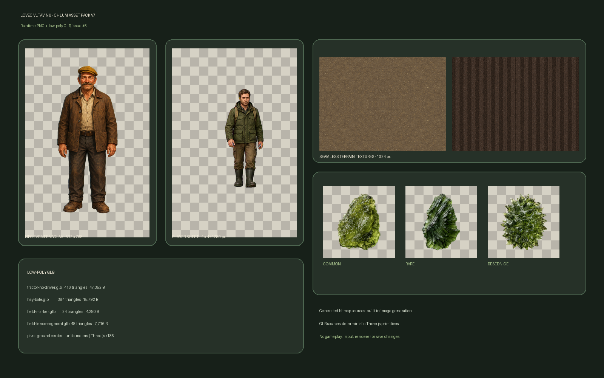

# Chlum asset pack v7

První integrační balík grafického proudu pro issue [#5](https://github.com/rajekroman/lovec-vltavinu/issues/5). Balík je omezen na Chlum vertical slice a nemění questy, vstup, renderer ani stav hry.

## Obsah

| ID | Soubor | Rozměr / geometrie | Skutečná velikost | Rozpočet | Dispose vlastník |
|---|---|---:|---:|---:|---|
| `player-hunter-walk` | `hunter-walk-sheet.png` | 1280×1280, 4×4 framy | 980 704 B | 1 000 000 B | `GameApp` |
| `npc-farmer-vaclav` | `farmer-vaclav.png` | 512×768 | 250 957 B | 300 000 B | `LevelScene:chlum` |
| `finding-vltavin-common` | `vltavin-common.png` | 256×256 | 87 926 B | 100 000 B | `LevelScene:chlum` |
| `finding-vltavin-rare` | `vltavin-rare.png` | 256×256 | 69 106 B | 100 000 B | `LevelScene:chlum` |
| `finding-vltavin-besednice` | `vltavin-besednice.png` | 256×256 | 90 229 B | 100 000 B | `LevelScene:chlum` |
| `terrain-chlum-field` | `chlum-field.png` | 1024×1024 | 1 019 726 B | 1 100 000 B | `LevelScene:chlum` |
| `terrain-chlum-furrows` | `chlum-furrows.png` | 1024×1024 | 1 017 092 B | 1 100 000 B | `LevelScene:chlum` |
| `model-chlum-tractor-no-driver` | `tractor-no-driver.glb` | 416 trojúhelníků | 47 352 B | 500 tris / 64 000 B | `LevelScene:chlum` |
| `model-chlum-hay-bale` | `hay-bale.glb` | 384 trojúhelníků | 15 792 B | 500 tris / 20 000 B | `LevelScene:chlum` |
| `model-chlum-field-marker` | `field-marker.glb` | 24 trojúhelníků | 4 280 B | 32 tris / 8 000 B | `LevelScene:chlum` |
| `model-chlum-field-fence-segment` | `field-fence-segment.glb` | 48 trojúhelníků | 7 716 B | 64 tris / 12 000 B | `LevelScene:chlum` |

Jediným strojově čitelným zdrojem metadat je [`assets/manifests/assets.json`](../../assets/manifests/assets.json). Obsahuje stabilní ID, relativní URL pro GitHub Pages, preload skupinu, rozměry, rozpočty, pivot/měřítko, průhlednost, dispose vlastníka a SHA-256 každého runtime souboru.

## Technická pravidla

- Sprity mají skutečný alfa kanál; průhledné plochy nejsou chroma-key pozadí.
- Hráčský atlas používá 16 buněk 320×320: čtyři směry, čtyři kroky.
- Terénní textury jsou neprůhledné, opakovatelné a nepřesahují 1024 px.
- GLB používají glTF 2.0, metry, osu Y vzhůru a lokální pivot u terénu.
- Traktor neobsahuje uzel ani geometrii řidiče.
- Plot, značka a balík slámy jsou určeny pro instancing a nemají vlastní bitmapové textury.

## Mobilní a výkonový dopad

Celý runtime balík má 3,43 MiB před HTTP kompresí. Největší jednotlivý asset má méně než 1,1 MB, všechny textury splňují limit 1024 px kromě sdíleného hráčského atlasu 1280 px, který zůstává pod kontraktním limitem 2048 px. Modely dohromady obsahují 872 trojúhelníků, takže geometrie Chlumu je vhodná i pro iPhone v portrait i landscape; finální čitelnost velikosti postav musí potvrdit až integrovaná Three.js scéna.

## Původ a omezení

Fotografická reference Chlumu pochází z podkladů projektu. Bitmapové sprity a textury byly vytvořeny vestavěným generátorem obrázků; GLB jsou nízkopoly modely exportované přes `THREE.GLTFExporter r185`. Asset pack zatím není zapojen do produkčního bootstrapu — to náleží architektonickému proudu a Chlum vertical slice. V tomto PR nevzniká save systém, inventář ani druhý renderer.

## Ověření

`tests/unit/asset-manifest.test.mjs` kontroluje manifest, unikátní ID/URL, soubory, SHA-256, PNG rozměry a alfa kanál, rozpočty, GLB 2.0 hlavičky, trojúhelníky, pivoty, absenci řidiče a HTTP načtení všech URL bez 404.
